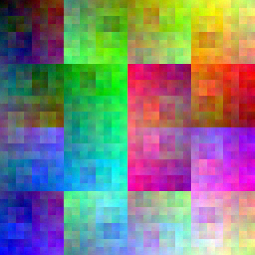
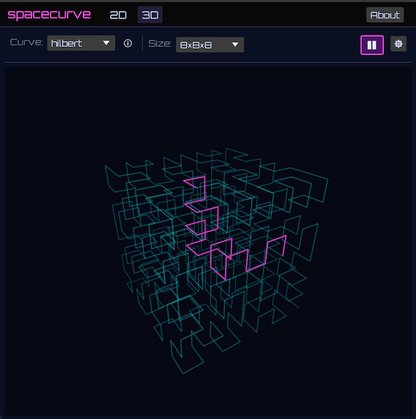

  

  generated with: '<code>scurve allrgb hilbert</code>'

A **space-filling curve** is a continuous surjection $f:[0,1]\to[0,1]^d$ for
$d\ge 2$. In discrete spaces, this is an ordering of grid cells that visits
every cell; some orderings preserve adjacency (e.g., Hilbert), while others
trade adjacency for simplicity (e.g., Morton/Z-order).

This project contains implementations of various space-filling curves, plus
tools for visualising and working with them.

# spacecurve

A Rust library for generating and working with space-filling curves.

# scurve

A command-line tool and GUI for generating images of space-filling curves. 

# playground

A GUI for visualising space-filling curves and their properties, written in
Rust with [egui](https://github.com/emilk/egui) and compiled to WebAssembly.

  

# related blog posts

Development on spacecurve (and its ancestors) is usually spurred along by posts
on my blog. Some of spacecurve's features are documented and illustrated in the
following posts:

- [Portrait of the Hilbert Curve](http://corte.si/posts/code/hilbert/portrait/index.html) 
- [Generating colour maps with space-filling curves](http://corte.si/posts/code/hilbert/swatches/index.html)
- [Hilbert Curve + Sorting Algorithms + Procrastination = ?](http://corte.si/posts/code/sortvis-fruitsalad/index.html)

# community

Want to contribute? Have ideas or feature requests? Come tell me about it on
[Discord](https://discord.gg/fHmRmuBDxF). 
